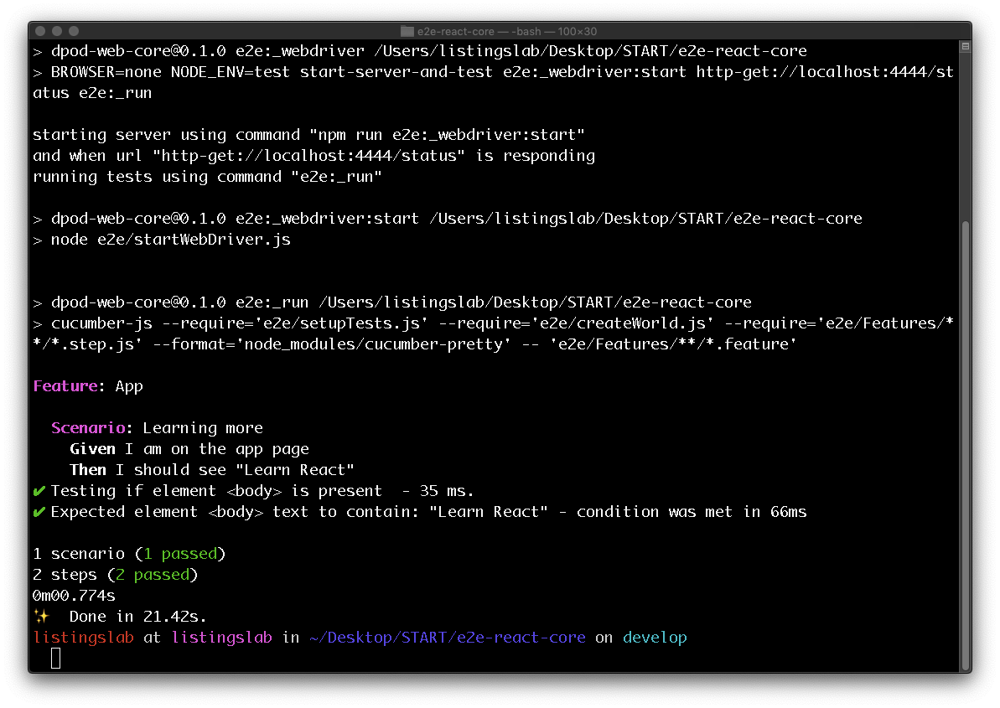

# Docs

[docs](./docs/index.md)

## react-e2e

End to End test a create-react-app bootstrapped React App 
using cucumber and nightwatch API.

(docs)[./docs/index.md]

### Install & Run e2e Test

```bash
cd <working-directory>
git clone https://<your-username>@bitbucket.org/boralconnectscrumteam/e2e-react-core.git
cd e2e-react-core
npm i
npm run e2e
```

- __Did you get a passing e2e test?__

